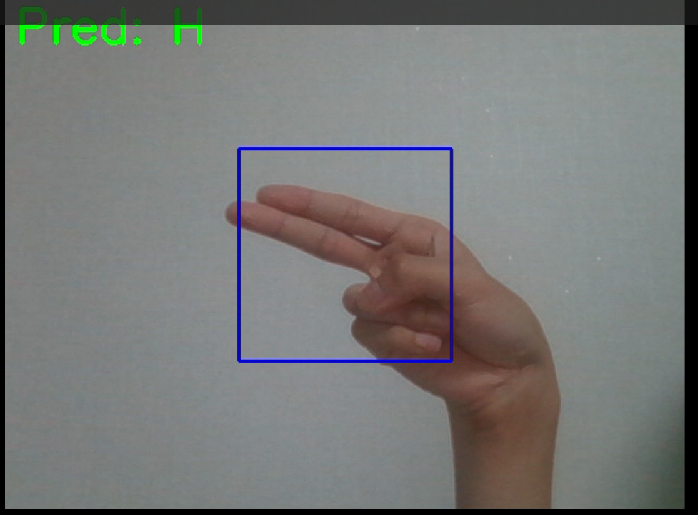
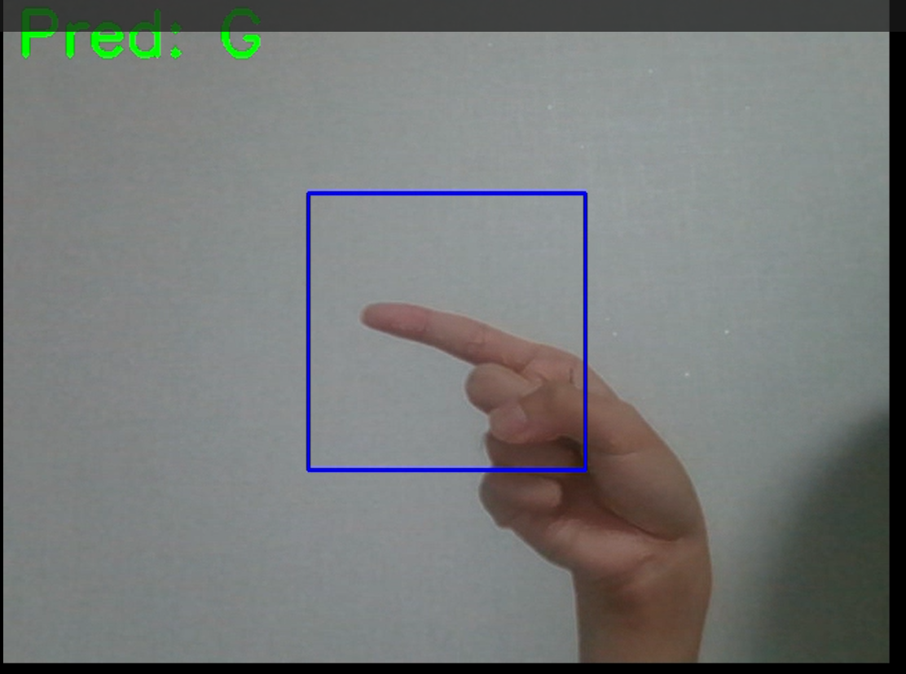
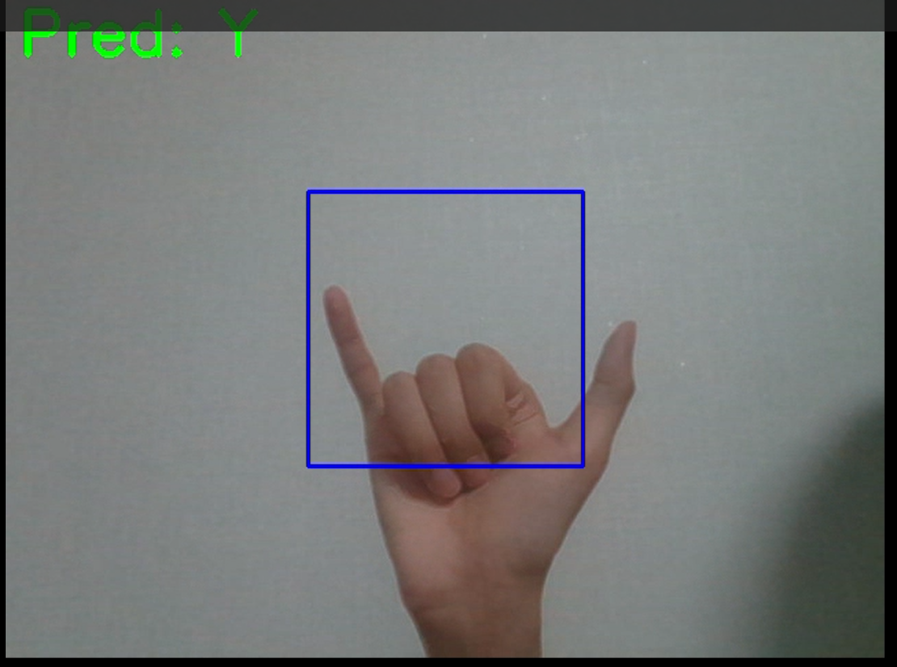

# Sign Language Recognition Project

## 📖 Project Overview

This project implements a real-time sign language recognition system using a Convolutional Neural Network (CNN) trained on the Sign Language MNIST dataset. It captures hand gestures from your webcam and predicts the corresponding alphabet letter.

## 🔧 Features

* ✅ Real-time inference from webcam video feed
* ✅ High-accuracy CNN model (`best_model.hdf5`)
* ✅ Simple command-line interface

## 🚀 Getting Started

### Prerequisites

* Python 3.8+
* `pip` package manager
* Webcam connected

### Installation

```bash
# Clone repo
git clone <your-repo-url> sign
cd sign

# Create and activate virtual environment
python -m venv venv
source venv/bin/activate   # macOS/Linux
venv\Scripts\activate    # Windows

# Install dependencies
pip install -r requirements.txt
```

### Folder Structure

```
sign/
├── data/                  # Raw and preprocessed datasets
├── src/                   # Source code
│   ├── data/              # Data loading & preprocessing
│   ├── models/            # Model definition & training
│   └── inference/         # Real-time inference scripts
├── models/                # Saved model weights
├── images/                # Example screenshots
│   ├── example1.png
│   ├── example2.png
│   └── example3.png
├── requirements.txt       # Python dependencies
└── README.md              # Project overview
```

## 🏃‍♂️ Usage

### 1. Train the Model (optional)

```bash
python src/models/train.py
```
https://www.kaggle.com/code/abdelrahmanzied/sign-language-classification-cnn-99-accuracy/notebook
의 output을 다운로드 하여 models에 넣고 실행
파일이 너무 커서 git에 올라가지 않음

This will produce `models/asl_cnn.h5`.

### 2. Run Real-time Inference

```bash
python src/inference/realtime.py
```

Press `q` to exit the webcam window.

## 📸 Examples

Below are three example predictions captured during inference:





https://www.kaggle.com/datasets/datamunge/sign-language-mnist
의 데이터셋을 사용하였습니다

https://www.kaggle.com/code/sayakdasgupta/sign-language-classification-cnn-99-40-accuracy/notebook
https://www.kaggle.com/code/abdelrahmanzied/sign-language-classification-cnn-99-accuracy/notebook
상기의 학습 방법을 참고하였습니다
